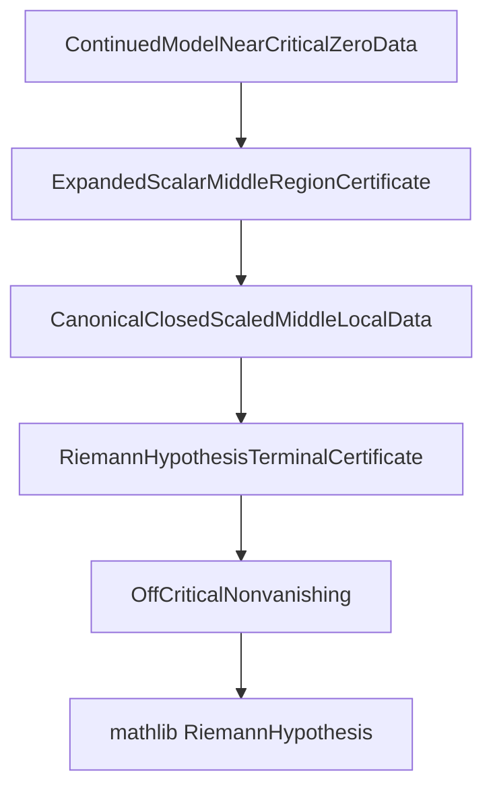

# Main Route Map

This document is the public, English-language map of the current formal route
from the C2 certificates to mathlib's `RiemannHypothesis` statement.

It supersedes local development maps for external review purposes. It uses the
review-facing terminology exposed through:

```lean
import LeanC2.PeerReview
```

The implementation remains in namespace `C2`; the stable audit facade is
namespace `C2.PeerReview`.

## Executive route

The current recommended route is:

1. Canonical near-critical-zero data for the continued C2 model:
   `C2.C2OddTailContinuedBalancingSeedBulkModelNearAxisData.ofContinuedModel`.
2. The empty edge certificate:
   `C2.C2OddTailContinuedBalancingSeedBulkModelEdgeData.empty`.
3. Concrete middle-region data for the continued bulk model.
4. The canonical local middle-region witness:
   `C2.C2CanonicalClosedScaledMiddleLocalData`.
5. The terminal certificate package:
   `C2.RiemannHypothesisTerminalData`.
6. Off-critical nonvanishing:
   `C2.offCriticalStripNonvanishing_of_terminalData`.
7. The official mathlib endpoint:
   `C2.mathlibRiemannHypothesis_of_terminalData`.

In the public facade, the final step is exposed as:

```lean
C2.PeerReview.RiemannHypothesis_of_terminalCertificate
```

The route uses the empty edge certificate:

```lean
C2.C2OddTailContinuedBalancingSeedBulkModelEdgeData.empty
```

No nontrivial edge-region construction is needed for the main route.



## Public audit entry points

| Purpose | Review-facing name | Internal declaration |
| --- | --- | --- |
| Stable facade import | `LeanC2.PeerReview` | imports `LeanC2.Analytic.GenuineBulkConcrete` |
| Optional continuation data | `GenuineC2ContinuationData` | `GenuineFInfiniteContinuationData` |
| Genuine operator | `GenuineC2Operator` | `genuineFInfinite` |
| Canonical continued-model near-critical-zero certificate | `ContinuedBulkNearCriticalZeroData_canonical` | `C2OddTailContinuedBalancingSeedBulkModelNearAxisData.ofContinuedModel` |
| Middle-region scalar package | `ExpandedScalarMiddleRegionCertificate` | `C2ExpandedScalarMiddleRegionData` |
| Canonical middle local witness | `CanonicalClosedScaledMiddleLocalData` | `C2CanonicalClosedScaledMiddleLocalData` |
| Terminal package | `RiemannHypothesisTerminalCertificate` | `RiemannHypothesisTerminalData` |
| Final theorem wrapper | `RiemannHypothesis_of_terminalCertificate` | `mathlibRiemannHypothesis_of_terminalData` |

## Recommended theorem entry points

Use these declarations depending on how much of the middle-region data has
already been packaged.

| Situation | Internal declaration |
| --- | --- |
| Pointwise canonical local witness route, no genuine continuation needed | `mathlibRiemannHypothesis_of_continuedModelMiddleLocal` |
| Continued-model canonical pointwise bounds, no genuine continuation needed | `mathlibRiemannHypothesis_of_continuedModelCanonicalClosedScaledMiddlePointwiseBounds` |
| Continued-model residual dominance bounds, no genuine continuation needed | `mathlibRiemannHypothesis_of_continuedModelCanonicalClosedScaledMiddleResidualPointwiseBounds` |
| Direct separated main-bounds route | `mathlibRiemannHypothesis_of_continuationAndExpandedScalarMiddleSeparatedMainBounds` |
| Canonical separated-bounds route | `mathlibRiemannHypothesis_of_continuationAndCanonicalClosedScaledMiddleSeparatedBounds` |
| Pointwise canonical local witness route via genuine continuation | `mathlibRiemannHypothesis_of_continuationAndMiddleLocal` |
| Single packaged terminal certificate | `mathlibRiemannHypothesis_of_terminalData` |
| Public facade endpoint | `C2.PeerReview.RiemannHypothesis_of_terminalCertificate` |

For the paper-facing route, prefer the terminal certificate formulation unless
the argument is specifically discussing one of the lower-level middle-region
interfaces.

## Lean files carrying the route

| Layer | File or module | What to inspect |
| --- | --- | --- |
| Final RH endpoint | `LeanC2/Foundations/Basic.lean` | `mathlibRiemannHypothesis_of_offCriticalStripNonvanishing` |
| Transfer to zeta | `LeanC2/Route/Transfer.lean` | `FundamentalIdentityOnRightHalfPlane`, `mathlibRiemannHypothesis_of_F_nonvanishing` |
| Abstract regional cover | `LeanC2/Roadmap.lean` | `NearAxisRouteData`, `RegionalVerticalBulkBoundsData`, `EdgeRouteData`, `OffCriticalCoverData` |
| Genuine continuation | `LeanC2/Analytic/GenuineContinuation.lean` | optional `GenuineFInfiniteContinuationData` and its identity fields |
| Continued-model near-critical-zero route | `LeanC2/Analytic/GenuineBulkConcrete/Base.lean` | `c2OddTailContinuedBalancingSeedBulkModel_eventually_ne_zero`, `C2OddTailContinuedBalancingSeedBulkModelNearAxisData.ofContinuedModel` |
| Near-axis certificates | `LeanC2/Route/NearAxis.lean`, `LeanC2/Route/NearAxisTaylor.lean` | `NearAxisCertificate` constructors |
| Near/middle/edge glue | `LeanC2/Analytic/GenuineCover.lean` | `GenuineFInfiniteNearBulkEdgeData.toOffCriticalCoverData` |
| Abstract bulk route | `LeanC2/Analytic/GenuineBulk.lean` | regional bulk wrappers |
| Public concrete bulk facade | `LeanC2/Analytic/GenuineBulkConcrete.lean` | stable import facade |
| Review facade | `LeanC2/PeerReview.lean` | public aliases and theorem wrappers |

## Concrete bulk module split

The former monolithic concrete bulk implementation is now split under:

```text
LeanC2/Analytic/GenuineBulkConcrete/
```

| Module | Role |
| --- | --- |
| `LeanC2.Analytic.GenuineBulkConcrete.Base` | Concrete/genuine bulk adapters, continued balancing-seed model, pinned near/bulk/edge data. |
| `LeanC2.Analytic.GenuineBulkConcrete.ConcreteEstimates` | Concrete estimates, scalar reductions, quartet estimates, exact-zeta dominance, and canonical constants. |
| `LeanC2.Analytic.GenuineBulkConcrete.ExpandedScalar` | Expanded scalar cover, local scalar-bulk data, and expanded middle-region packages. |
| `LeanC2.Analytic.GenuineBulkConcrete.ComponentRoutes` | Component truncation and resolvent-note middle-region packages. |
| `LeanC2.Analytic.GenuineBulkConcrete.Terminal` | Canonical closed/scaled middle witnesses and the terminal route to `RiemannHypothesis`. |
| `LeanC2.Analytic.GenuineBulkConcrete.ContinuationRoutes` | Continuation-driven constructors and genuine-central resolvent non-cancellation packages. |
| `LeanC2.Analytic.GenuineBulkConcrete.Endpoints` | Final endpoint wrappers and explicit cutoff/existence corollaries. |

The smallest module containing the canonical terminal certificate route is:

```lean
import LeanC2.Analytic.GenuineBulkConcrete.Terminal
```

The complete public route remains available through:

```lean
import LeanC2.Analytic.GenuineBulkConcrete
```

## Middle-region certificate families

| Family | Role |
| --- | --- |
| `C2ExpandedScalarScaleData` | Positivity and geometric scale data for the expanded scalar route. |
| `C2ExpandedHorizontalLayerBudget` | Horizontal off-axis layer budget. |
| `C2ExpandedSeedScaledBound` | Scaled seed bound. |
| `C2ExpandedCutoffScaledBound` | Scaled cutoff bound. |
| `C2ExpandedQuartetDominance` | Main dominant four-level block inequality. |
| `C2ExpandedScalarMainInequalities` | Bundles seed, cutoff, and dominance hypotheses. |
| `C2ExpandedScalarLocalBulkData` | Complete local witness for the expanded scalar route. |
| `C2CanonicalClosedScaledLocalData` | Canonical compression of the local witness. |
| `C2CanonicalClosedScaledVerticalBudgetLocalData` | Canonical route with an external vertical budget. |
| `C2CanonicalClosedScaledVerticalTruncationLocalData` | Canonical route separating vertical and horizontal truncation. |
| `C2CanonicalClosedScaledResidualBudgetLocalData` | Residual route with separated tilt, horizontal, and cutoff budgets. |
| `C2QuartetComponentTruncationLocalData` | Component-level truncation variant. |
| `C2QuartetComponentResolventNoteLocalData` | Variant aligned with the resolvent-note decomposition. |
| `C2ResolventNonCancellationGenuineCentralLocalData` | Genuine-central resolvent non-cancellation package. |

The corresponding public aliases are listed in
`docs/BOUNDS_CERTIFICATES_WITNESSES.md`.

## Regional and terminal packages

| Internal declaration | Role |
| --- | --- |
| `C2ExpandedScalarMiddleRegionData` | Regional version of the expanded scalar route. |
| `C2CanonicalClosedScaledCoverData` | Complete near/middle/edge cover in the canonical route. |
| `C2CanonicalClosedScaledMiddleRegionData` | Middle-region package using canonical closed/scaled estimates. |
| `C2CanonicalClosedScaledMiddleLocalData` | Minimal local obligations for the canonical middle-region route. |
| `RiemannHypothesisTerminalData` | Final package that implies mathlib `RiemannHypothesis`. |

## Base estimate files

The concrete middle-region bounds are assembled from the following technical
files.

| File | Main content |
| --- | --- |
| `LeanC2/Operators/VerticalResolvent.lean` | `q`, `geom_resolvent`, `verticalDepthTailUpper`, `resolvent_lower_bound`, `verticalQuartetPrefix` |
| `LeanC2/Route/Dominance.lean` | Abstract dominance lemmas such as `no_zero_of_dominance`. |
| `LeanC2/Route/BulkReal.lean` | Basic analytic region and margin definitions. |
| `LeanC2/Route/BulkErrors.lean` | Error envelopes and bulk error margins. |
| `LeanC2/Route/BulkQuartet.lean` | Vertical quartet and analytic bulk regions. |
| `LeanC2/Route/BulkHorizontal.lean` | Regularized horizontal budgets. |
| `LeanC2/Route/BulkTilt.lean` | Tilt bounds and truncated/geometric/analytic variants. |
| `LeanC2/Route/BulkCutoff.lean` | Cutoff upper bounds as a function of scale. |
| `LeanC2/Route/BulkOddTail.lean` | Odd-tail bounds and seeded/scaled variants. |
| `LeanC2/Route/BulkEstimates.lean` | Combined scalar estimate packages. |
| `LeanC2/Route/BulkConcrete.lean` | Concrete oscillatory witnesses for cutoff/exponential estimates. |
| `LeanC2/Route/BulkResolventNonCancellationTilt.lean` | Roadmap-level resolvent non-cancellation interface. |
| `LeanC2/Route/VerticalBulkReal.lean` | Vertical-resolvent route package at the `RegionalVerticalBulkBoundsData` level. |

## Main route versus optional branches

The current paper-facing route is:

```text
continued C2 model
  -> canonical near-critical-zero data
  -> canonical middle local witness
  -> terminal certificate
  -> transfer to mathlib RiemannHypothesis
```

The facade also exposes sharper entry points where the middle witness is not
provided as a single object: the pointwise canonical closed/scaled route and
the residual-dominance route over
`c2ContinuedModelTerminalMiddleRegion`.

The older continuation-driven route is still available as an audit variant:

```text
genuine continuation
  -> near-critical-zero data from continuation
  -> canonical middle local witness
  -> terminal certificate
```

The following families exist and are useful for inspection, but they are not
required as the shortest audit path:

- `quartetExact`, `quartetTriangle`, `quartetClosed`, and `quartetComponent`
  variants.
- Canonical closed/scaled residual variants by majorant, vertical budget, and
  vertical truncation.
- Resolvent-note variants.
- Concrete pointwise oscillatory and exponential pointwise oscillatory witness
  variants.
- Cover wrappers such as concrete cover, subset cover, and expanded scalar
  cover wrappers.

## Formally non-terminal residual route

The fully explicit finite exact-zeta residual route is kept in Lean as a
documented obstruction, not as the current terminal target.

The relevant formal lemmas are:

- `c2ExpandedQuartetResidualMargin_lt_scaledVerticalDepthTail_of_offCriticalStrip`
- `c2AnalyticBulkAllowance_sub_reserve_lt_scaledVerticalDepthTail_of_offCriticalStrip`
- `not_c2CanonicalClosedScaledResidualFiniteExactZetaUpper_lt_analyticResidual_of_offCriticalStrip`

Practical reading: the current terminal route should use sharper middle-region
witnesses and packages rather than forcing this coarse residual inequality.

## Verification

The review build command is:

```bash
lake build LeanC2.Analytic.GenuineBulkConcrete LeanC2.PeerReview LeanC2
```

This checks the concrete route, the public facade, and the exported Lean tree.
